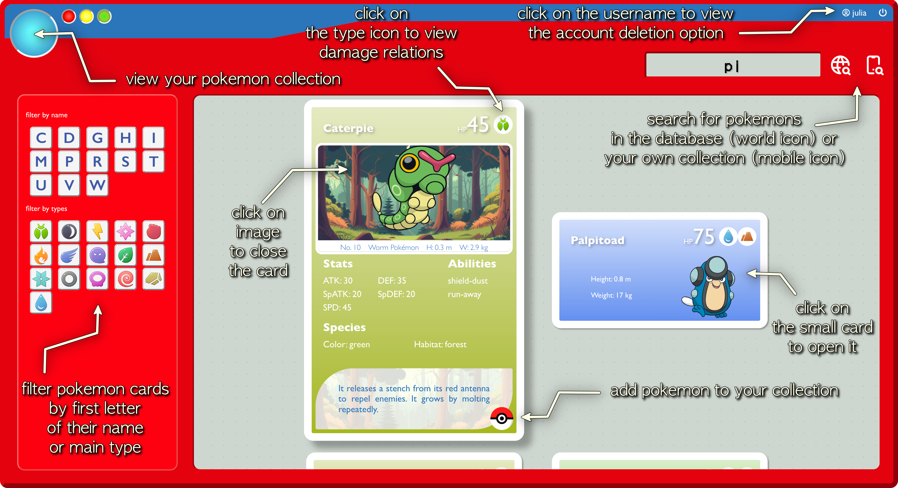

# Pokémon collection App
> A simple web application that allows you to search for pokemons from Pokéapi (RESTful Pokémon API) and save it to your account as a pokemon cards.
> Live demo [_here_](https://pokemon-a6c4f.web.app/).

## General Information
- I created this simple app for Pokémon fans, to help them get to know their favorite pocket monsters even better.
- While working on the app, I learn how to made a project based on the ReactJS, using public API and Firebase.

## Technologies Used
Project is created with:
- ReactJS 18.2.0
- Firebase 9.23.0
- axios 1.4.0
- sass 1.63.6
- react-icons 4.11.0
- Font Awesome 6.4.2 (with Font Awesome React component 0.2.0)

## Features
List the ready features here:
- Creating your account (for demonstration purposes only) where you can store your pokemon collection.
- Searching for Pokémon in the PokeAPI database and your collection
- The result of the search in the form of a card with information about the Pokémon [card img]
- Adding pokemons to your collection [button img]
- Filtering search results and your entire collection by first letters and pokemon types
- The table displays pro and cons of attack and defense in the pokemon type [button img]

## Screenshots

## Sources
I got the idea to use the public API and the first tips on how to do it from the [@PedroTechnologies] (https://www.youtube.com/@PedroTechnologies) tutorial Building a Pokemon Web App - Pokemon API ReactJS.
I also followed tutorials on how to use Firebase:
- Firebase Fundamentals by [@Firebase] (https://www.youtube.com/@Firebase)
- Firebase React Course For Beginners and CRUD Tutorial Using React + Firebase 9 and Firestore Tutorial by [@PedroTechnologies] (https://www.youtube.com/@PedroTechnologies)
- React Authentication Crash Course With Firebase And Routing by [@WebDevSimplified] (https://www.youtube.com/@WebDevSimplified)